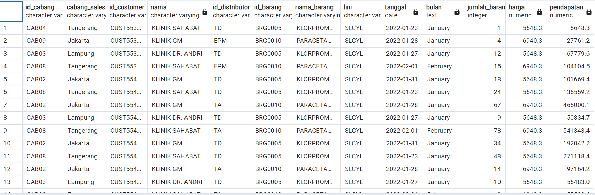
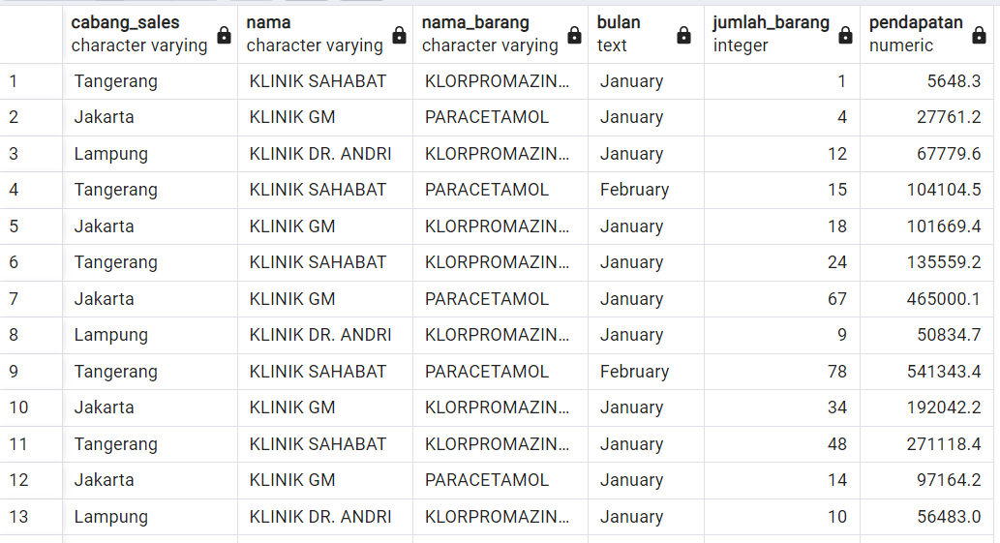
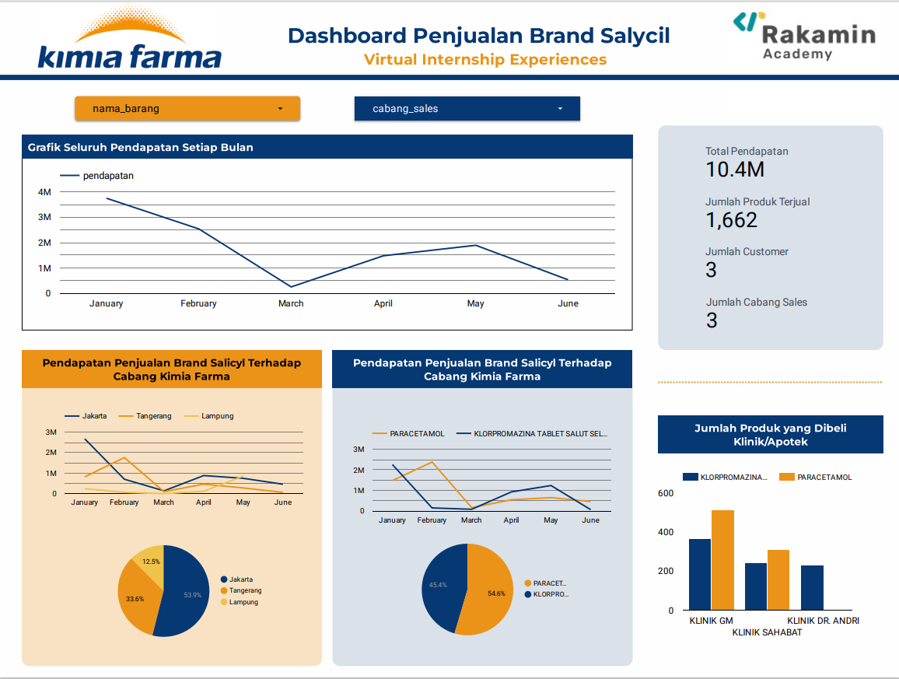

# Kimia Farma_Dashboard for Salicyl Brand Sales
## Data Warehouse, Data Lake, and Data Mart
There are three types repository data:
- Data Warehouse: The place where all the data gathered in one repository and most likely, the data very unstructure.
- Data Lake: A derivative of the data warehouse but has been tidied up and more structured but the scope is still very broad
- Data Mart: A dervative from a data lake and aimed for a particular field analysis data.
For this task, we need to make a data mart with just contained Salicyl Brand from the Data Lake

## Dataset
The dataset formed Excel with three sheets: Sheet 'penjualan', 'pelanggan', and 'barang'
- Sheet 'penjualan': contain sales data for the entire year
- Sheet 'pelanggan': contain customer data
- Sheet 'barang': contain products from Kimia Farma with several brands, including Salicyl Brand <br>
From the database, we need to make Table Base and Table Aggregate. Table base contained raw data for the Salicyl Brand whereas Table Aggregate is derivied from Tabel Base and contain more short data to visualize with Google Data Studio

## Table and SQL Queries
### Table Base
Here are my SQL Queries to create the Table Base: <br>
```sql
Create table Tabel_base_salicyl as
select 
	penjualan.id_cabang,
	pelanggan.cabang_sales,
	penjualan.id_customer,
	pelanggan.nama,
	penjualan.id_distributor,
	penjualan.id_barang,
	barang.nama_barang,
	barang.lini,
	penjualan.tanggal,
	to_char(penjualan.tanggal, 'Month') as bulan,
	penjualan.jumlah_barang,
	penjualan.harga
from penjualan 
join barang on barang.kode_barang = penjualan.id_barang
join pelanggan on penjualan.id_customer = pelanggan.id_customer
where barang.lini = 'SLCYL'
```

I create the table base with the ERD:
<p align="center">
  <kbd></kbd><br>
  Figure 1. ERD for the making of Table Base
  </p>

The result of the Table Base:<br>
<p align="center">
  Table 1. Table Base <br>
  <kbd></kbd>
  </p>
 
 ### Table Aggregate
 Aggregate tables are generated from base tables which contain denser data and are used for data visualization with Google Data Studio.<br>
 Here are my SQL Queries to create the Table Base: <br>
 ```sql
 create table tabel_aggregate_salycil as
	select 
		cabang_sales,
		nama,
		nama_barang,
		bulan,
		jumlah_barang,
		pendapatan
	from tabel_base_salicyl
```
The result of the Table Aggregate:<br>
<p align="center">
  Table 2. Table Aggregate<br>
  <kbd></kbd>
  </p>

## Dashboard
Table Aggregate inputed to the Google Data Studio and created the dashboard. Here's the dashboard that I've been creating:
<p align="center">
  <kbd></kbd><br>
  Figure 2. Dashboard for Salicyl Brand Sales
  </p>

[Link Dashboard Google Data Studio](https://lookerstudio.google.com/u/0/reporting/ba9ad45d-d78b-4483-b355-b39a18b9428a/page/25KHD)

